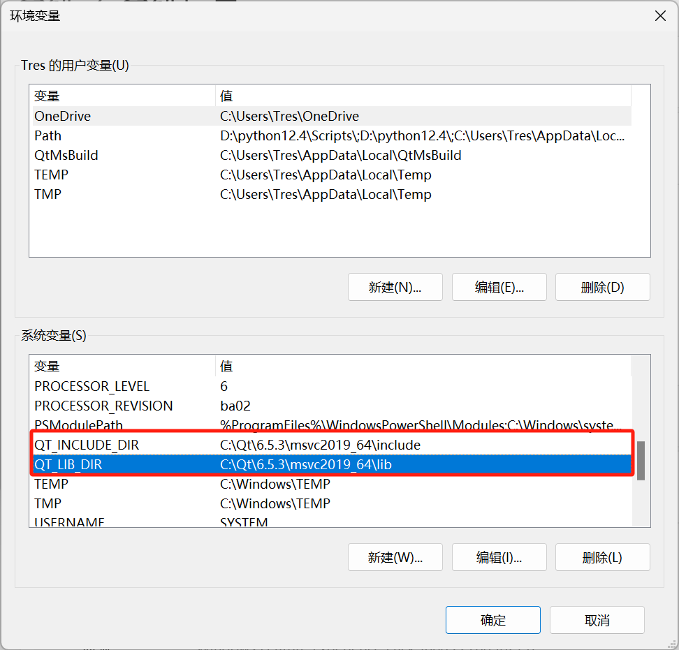

# windows下编译
## 配置环境变量

在系统环境变量中设置qt开发环境对应编译器的include与lib路径，让xmake能直接通过环境变量索引



通过一下指令验证环境变量配置

```shell
--powershell
echo $env:QT_INCLUDE_DIR
echo $env:QT_LIB_DIR
--cmd
echo $QT_INCLUDE_DIR
echo $QT_LIB_DIR
```

# Ubuntu下编译

## 配置环境

###安装qt环境

```shell
sudo apt install qt6-base-dev
```

###配置环境变量

在 Bash 中临时设置：

```shell
export QT_INCLUDE_DIR="/usr/include/x86_64-linux-gnu/qt6"
export QT_LIB_DIR="/usr/lib/x86_64-linux-gnu"
```

永久设置（编辑 `~/.bashrc` 或 `~/.bash_profile`）：

```shell
echo 'export QT_INCLUDE_DIR="/usr/include/qt6"' >> ~/.bashrc
echo 'export QT_LIB_DIR="/usr/lib/x86_64-linux-gnu"' >> ~/.bashrc
source ~/.bashrc
```

验证环境变量

```shell
echo $QT_INCLUDE_DIR
echo $QT_LIB_DIR
```

# xmake编译

```makefile
xmake
```

运行

```
xmake run
```

